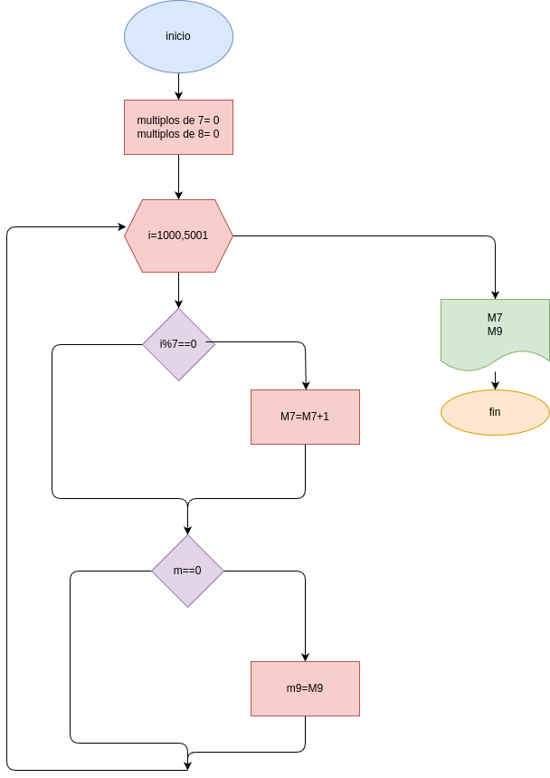

## multiplos de 7 y 9

## Analisis

### Variable de entrada
i= multiplos de 7 y de 9 entre 1000 y 5000

### procedimiento
n=1000
cantidad_multiplos_7 = 0
cantidad_multiplos_9 = 0

for i in range(1000, 5001):
    m7 = i % 7
    m9 = i % 9
    if (m7 == 0):
        n=n+1
        cantidad_multiplos_7 = cantidad_multiplos_7 + 1
        print(f"el nuemero {n} es multiplo de 7")
    if (m9 == 0):
        n=n+1
        cantidad_multiplos_9 = cantidad_multiplos_9 + 1
        print(f"el nuemero {n} es multiplo de 9")
    else:
        n=n+1

## Diseño

## frase
