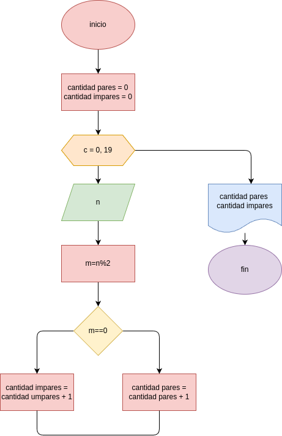

# pares_impares
programa para calcular cuantos numeros pares y impares hay en una lista de numeros

## analisis

### variable de entrada 
x = digie los numeros 

### procedimiento

cantidad_pares = 0
cantidad_impares = 0

for i in range(1, 21):
    n= int(input("digite el numero " + str(i) + ": "))
    m = n % 2
    if (m==0):
        cantidad_pares = cantidad_pares + 1
    else:
        cantidad_impares = cantidad_impares + 2

## diseño

## frase
